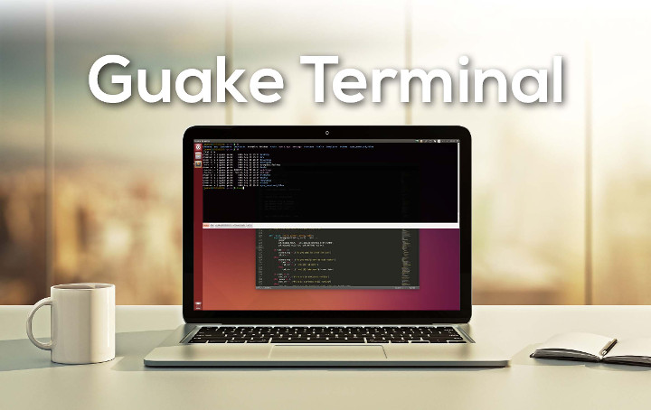

.. Guake User documentation

Guake User Documentation
========================

Welcome to the official Guake User Documentation.

Guake is a dropdown terminal made for the GNOME desktop environment. Guake's style of window is
based on a famous FPS game, and one of its goals is to be easy to reach and developer friendly.

Main Features
=============

- Lightweight
- Simple Easy and Elegant
- Smooth integration of terminal into GUI
- Appears when you call and disappears once you are done by pressing a predefined hotkey (F12 by
  default)
- Compiz transparency support
- Multi tab
- Plenty of color palettes
- Quick Open in your favorite text editor with a click on a file name (with line number support)
- Customizable hotkeys for tab access, reorganization, background transparency, font size,...
- Extremely configurable
- Configure Guake startup by running a bash script when Guake starts
- Multi-monitor support (open on a specified monitor, open on mouse monitor)
- Save terminal content to file
- Open URL to your browser

.. toctree::
   :caption: Guake Documentation
   :maxdepth: 2

   user/index
   project/index
   contributing/index

Useful links
============

Source Code available at: https://github.com/Guake/guake/

Official Homepage: http://guake-project.org

Online Documentation: http://guake.readthedocs.io/

**Important note**: Do **NOT** use the domain ``guake.org``, it has been registered by someone
outside the team.
We cannot be held responsible for the content on that web site.
