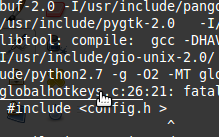
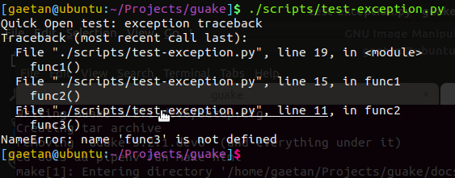
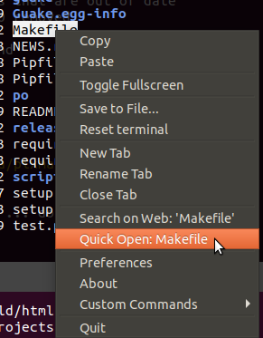

Guake 3 Features
****************

TBD: Long description of each feature

Single Hotkey terminal
======================

TBD:

- Appears when you call and disappears once you are done by pressing a predefined hotkey (F12 by
  default)
- Customizable hotkeys for tab access, reorganization, background transparency, font size,...

Auto-start
==========

Guake can now (>=3.1) starts automatically on GNOME startup.

Advanced Tab Support
====================

Guake has several modes available to manage tab. You can let guake automatically rename the tab
or give you own name.

Color Palettes
==============

Thanks to the Guake community, a huge number of Terminal palettes are provided out of the box.

Gtk Theme
=========

Guake allows you to choose a different Gtk theme than your environment.

.. note:: You need to restart Guake after changing the GTK theme.

Quick Open, hyperlink and Search on web
=======================================

Guake automatically finds URL printed in your terminal and allow you to click on it using
``[Ctrl]+click``. Many other terminals, if not all, does that already.

Quick-Open
----------

Guake is also able to find out file names and open it in your favorite code editor, such as
Visual Studio Code, Atom or SublimText.

Guake brings this to much more, by automatically parsing output of popular system commands such
as ``gcc``, Python's traceback or ``pytest`` report, and allowing you to automatically open the
file at the correct line number. Guake is even able to find the Python function name automatically
when used with ``pytest``.

Even if Guake cannot parse the output, you can still ask him to open a wanted file path displayed
in your terminal, provided the file exists at this path. Simply select the full path and click
using the ``[Ctrl]+click``, or with the contextual menu on right click.

Contextual menu
---------------

Right click also displays "Search on web" (if you have selected a text) and "Open link" (if the
text under the cursor is a URL or if the selected text is a URL).

Guake also supports
`HTML-like anchor <https://gist.github.com/egmontkob/eb114294efbcd5adb1944c9f3cb5feda>`_ with
special characters such as::

    echo -e '\e]8;;http://example.com\aThis is a link\e]8;;\a'

HTML-like anchors
-----------------

You may need a recent version of the VTE (Virtual Terminal Emulator) component in you system
(vte >= 0.50).

Multi Monitor
=============

TBD: Multi-monitor support (open on a specified monitor, open on mouse monitor)

Hook points
===========

TBD: Configure Guake startup by running a bash script when Guake starts

Save Terminal Content
=====================
TBD: Save terminal content to file

Custom Commands
===============

TBD

DBus commands
=============

The major features of guake are available on DBus.

Tab UUID
========

Tabs are uniquely identified with a UUID. Each terminal receives this UUID in the following
environment varialbe: ``GUAKE_TAB_UUID``. It can be used to rename the tab from the command line
using ``--tab-index 3c542bc1-7c99-4e73-8d37-e08281bd592c``.
